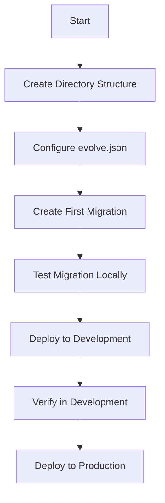
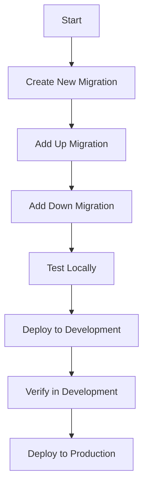
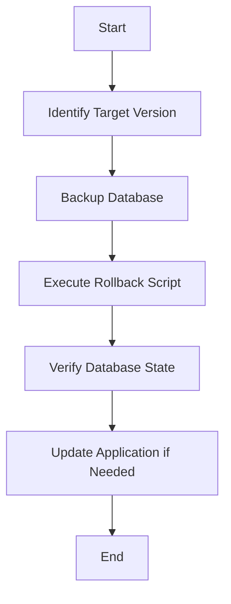
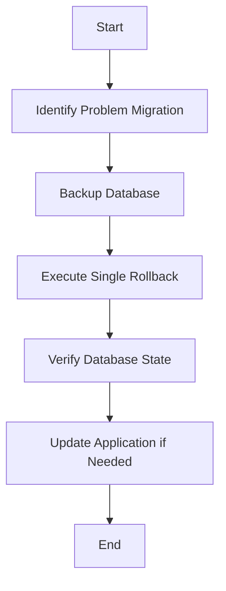

# Evolve Migration Guide

## Table of Contents
1. [Overview](#overview)
2. [Directory Structure](#directory-structure)
3. [Configuration](#configuration)
4. [Migration Workflows](#migration-workflows)
5. [Rollback Strategies](#rollback-strategies)
6. [Deployment Scenarios](#deployment-scenarios)
7. [Troubleshooting](#troubleshooting)

## Overview

Evolve is a database migration tool that helps manage database schema changes. This guide covers how we use Evolve with PostgreSQL on Amazon RDS, including migrations, rollbacks, and deployment strategies.

## Directory Structure

```
Data/Evolve/
├── migrations/
│   ├── up/          # Forward migrations
│   ├── down/        # Rollback migrations
│   └── backup/      # Backup of original migrations
├── docker-compose.yml
├── rollback.ps1
└── evolve.json
```

## Configuration

### evolve.json
```json
{
  "locations": ["migrations/up"],
  "isEraseDisabled": true,
  "commandTimeout": 30,
  "metadataTableSchema": "fee_nominal",
  "metadataTableName": "evolve_changelog",
  "placeholders": {
    "schema": "fee_nominal"
  }
}
```

Key configuration parameters:
- `locations`: Directory containing migration files
- `isEraseDisabled`: Prevents accidental database erasure
- `commandTimeout`: Maximum time for migration execution
- `metadataTableSchema`: Schema for the changelog table
- `metadataTableName`: Name of the changelog table
- `placeholders`: Reusable values in migrations

### Schema Configuration

#### Understanding Schemas vs SearchPath

There are two important but different schema-related configurations in Evolve:

1. **Schemas in evolve.json**:
   ```json
   {
     "Schemas": ["fee_nominal"]
   }
   ```
   - Used by Evolve to manage schema creation and tracking
   - Determines where the metadata table (`evolve_changelog`) is created
   - Controls which schemas Evolve will manage
   - Does NOT affect PostgreSQL's runtime behavior

2. **SearchPath in Connection String**:
   ```bash
   evolve migrate postgresql -c "Host=localhost;Port=5432;Database=feenominal;Username=postgres;Password=postgres;SearchPath=fee_nominal"
   ```
   - Used by PostgreSQL to set the default schema context
   - Required for proper object resolution during migrations
   - Ensures SQL commands use the correct schema
   - Must be included in every connection string

#### Why Both Are Needed

Example scenarios showing why both configurations are necessary:

1. **Missing Schemas in evolve.json**:
   ```json
   {
     // Schemas array missing
     "MetadataTableName": "evolve_changelog"
   }
   ```
   Result:
   - Evolve won't know which schemas to manage
   - Metadata table might be created in wrong schema
   - Schema creation might be skipped
   - Error: "Schema 'fee_nominal' does not exist"

2. **Missing SearchPath in Connection String**:
   ```bash
   evolve migrate postgresql -c "Host=localhost;Port=5432;Database=feenominal;Username=postgres;Password=postgres"
   ```
   Result:
   - PostgreSQL won't know which schema to use by default
   - Unqualified table names will fail
   - Error: "relation does not exist"
   - Migrations might target wrong schema

3. **Correct Configuration**:
   ```json
   {
     "Schemas": ["fee_nominal"],
     "MetadataTableName": "evolve_changelog"
   }
   ```
   ```bash
   evolve migrate postgresql -c "Host=localhost;Port=5432;Database=feenominal;Username=postgres;Password=postgres;SearchPath=fee_nominal"
   ```
   Result:
   - Evolve manages schema creation and tracking
   - PostgreSQL uses correct schema context
   - Migrations work as expected
   - All objects created in correct schema

#### Best Practices

1. **Always Include Both**:
   ```json
   // evolve.json
   {
     "Schemas": ["fee_nominal"],
     "MetadataTableName": "evolve_changelog"
   }
   ```
   ```bash
   # Connection string
   evolve migrate postgresql -c "Host=localhost;Port=5432;Database=feenominal;Username=postgres;Password=postgres;SearchPath=fee_nominal"
   ```

2. **Verify Schema Configuration**:
   ```bash
   # Check if schema exists
   evolve info postgresql -c "Host=localhost;Port=5432;Database=feenominal;Username=postgres;Password=postgres;SearchPath=fee_nominal" --verbose
   ```

3. **Test Schema Access**:
   ```bash
   # Dry run to verify schema access
   evolve migrate postgresql -c "Host=localhost;Port=5432;Database=feenominal;Username=postgres;Password=postgres;SearchPath=fee_nominal" --dry-run
   ```

4. **Multiple Schemas**:
   If using multiple schemas:
   ```json
   {
     "Schemas": ["fee_nominal", "fee_nominal_audit"],
     "MetadataTableName": "evolve_changelog"
   }
   ```
   ```bash
   evolve migrate postgresql -c "Host=localhost;Port=5432;Database=feenominal;Username=postgres;Password=postgres;SearchPath=fee_nominal,fee_nominal_audit"
   ```

## Evolve CLI Commands and Options

### Basic Commands

1. **Migrate**:
   ```bash
   # Basic migration
   evolve migrate postgresql -c "Host=localhost;Port=5432;Database=feenominal;Username=postgres;Password=postgres;SearchPath=fee_nominal"

   # With specific location
   evolve migrate postgresql -c "Host=localhost;Port=5432;Database=feenominal;Username=postgres;Password=postgres;SearchPath=fee_nominal" -l migrations/up

   # With schema specification
   evolve migrate postgresql -c "Host=localhost;Port=5432;Database=feenominal;Username=postgres;Password=postgres;SearchPath=fee_nominal"

   # With command timeout
   evolve migrate postgresql -c "Host=localhost;Port=5432;Database=feenominal;Username=postgres;Password=postgres;SearchPath=fee_nominal" --command-timeout 60
   ```

2. **Repair**:
   ```bash
   # Fix changelog table
   evolve repair postgresql -c "Host=localhost;Port=5432;Database=feenominal;Username=postgres;Password=postgres;SearchPath=fee_nominal"

   # With specific version
   evolve repair postgresql -c "Host=localhost;Port=5432;Database=feenominal;Username=postgres;Password=postgres;SearchPath=fee_nominal" -v V5
   ```

3. **Info**:
   ```bash
   # Show migration status
   evolve info postgresql -c "Host=localhost;Port=5432;Database=feenominal;Username=postgres;Password=postgres;SearchPath=fee_nominal"

   # With detailed output
   evolve info postgresql -c "Host=localhost;Port=5432;Database=feenominal;Username=postgres;Password=postgres;SearchPath=fee_nominal" --verbose
   ```

### Advanced Options

1. **Connection String Options**:
   ```bash
   # Full connection string with all options
   evolve migrate postgresql -c "Host=localhost;Port=5432;Database=feenominal;Username=postgres;Password=postgres;SearchPath=fee_nominal;CommandTimeout=30;TrustServerCertificate=true;Integrated Security=false"
   ```

2. **Migration Control**:
   ```bash
   # Migrate to specific version
   evolve migrate postgresql -c "Host=localhost;Port=5432;Database=feenominal;Username=postgres;Password=postgres;SearchPath=fee_nominal" -v V5

   # Dry run (no actual changes)
   evolve migrate postgresql -c "Host=localhost;Port=5432;Database=feenominal;Username=postgres;Password=postgres;SearchPath=fee_nominal" --dry-run

   # With transaction control
   evolve migrate postgresql -c "Host=localhost;Port=5432;Database=feenominal;Username=postgres;Password=postgres;SearchPath=fee_nominal" --transaction-mode=per-migration
   ```

3. **Logging and Output**:
   ```bash
   # Verbose output
   evolve migrate postgresql -c "Host=localhost;Port=5432;Database=feenominal;Username=postgres;Password=postgres;SearchPath=fee_nominal" --verbose

   # Output to file
   evolve migrate postgresql -c "Host=localhost;Port=5432;Database=feenominal;Username=postgres;Password=postgres;SearchPath=fee_nominal" > migration.log 2>&1

   # With color output
   evolve migrate postgresql -c "Host=localhost;Port=5432;Database=feenominal;Username=postgres;Password=postgres;SearchPath=fee_nominal" --color
   ```

### Common Use Cases

1. **Development Workflow**:
   ```bash
   # Check current state
   evolve info postgresql -c "Host=localhost;Port=5432;Database=feenominal;Username=postgres;Password=postgres;SearchPath=fee_nominal"

   # Run new migrations
   evolve migrate postgresql -c "Host=localhost;Port=5432;Database=feenominal;Username=postgres;Password=postgres;SearchPath=fee_nominal"

   # Verify changes
   evolve info postgresql -c "Host=localhost;Port=5432;Database=feenominal;Username=postgres;Password=postgres;SearchPath=fee_nominal" --verbose
   ```

2. **Production Deployment**:
   ```bash
   # Dry run first
   evolve migrate postgresql -c "Host=localhost;Port=5432;Database=feenominal;Username=postgres;Password=postgres;SearchPath=fee_nominal" --dry-run

   # Execute with timeout and logging
   evolve migrate postgresql -c "Host=localhost;Port=5432;Database=feenominal;Username=postgres;Password=postgres;SearchPath=fee_nominal" --command-timeout 60 --verbose > production-migration.log 2>&1

   # Verify deployment
   evolve info postgresql -c "Host=localhost;Port=5432;Database=feenominal;Username=postgres;Password=postgres;SearchPath=fee_nominal" --verbose
   ```

3. **Troubleshooting**:
   ```bash
   # Check changelog
   evolve info postgresql -c "Host=localhost;Port=5432;Database=feenominal;Username=postgres;Password=postgres;SearchPath=fee_nominal" --verbose

   # Repair changelog
   evolve repair postgresql -c "Host=localhost;Port=5432;Database=feenominal;Username=postgres;Password=postgres;SearchPath=fee_nominal"

   # Test connection
   evolve migrate postgresql -c "Host=localhost;Port=5432;Database=feenominal;Username=postgres;Password=postgres;SearchPath=fee_nominal" --dry-run
   ```

### Command Line Options Reference

| Option | Description | Example |
|--------|-------------|---------|
| `-c, --connection-string` | Database connection string | `-c "Host=localhost;Port=5432;Database=feenominal"` |
| `-l, --location` | Migration files location | `-l migrations/up` |
| `-v, --version` | Target version | `-v V5` |
| `--dry-run` | Preview changes without applying | `--dry-run` |
| `--verbose` | Detailed output | `--verbose` |
| `--command-timeout` | Command timeout in seconds | `--command-timeout 60` |
| `--transaction-mode` | Transaction handling mode | `--transaction-mode=per-migration` |
| `--color` | Enable colored output | `--color` |

### Best Practices for CLI Usage

1. **Always Use Dry Run First**:
   ```bash
   evolve migrate postgresql -c "Host=localhost;Port=5432;Database=feenominal;Username=postgres;Password=postgres;SearchPath=fee_nominal" --dry-run
   ```

2. **Use Verbose Mode for Debugging**:
   ```bash
   evolve migrate postgresql -c "Host=localhost;Port=5432;Database=feenominal;Username=postgres;Password=postgres;SearchPath=fee_nominal" --verbose
   ```

3. **Set Appropriate Timeouts**:
   ```bash
   evolve migrate postgresql -c "Host=localhost;Port=5432;Database=feenominal;Username=postgres;Password=postgres;SearchPath=fee_nominal" --command-timeout 60
   ```

4. **Log All Operations**:
   ```bash
   evolve migrate postgresql -c "Host=localhost;Port=5432;Database=feenominal;Username=postgres;Password=postgres;SearchPath=fee_nominal" > migration-$(date +%Y%m%d-%H%M%S).log 2>&1
   ```

## Migration Workflows

### Initial Setup



### Regular Migration Process



## Rollback Strategies

### Complete Rollback



### Individual Step Rollback



### Detailed Rollback Examples

1. **Rolling Back a Table Addition**:
   ```sql
   -- Original Migration (V12__add_user_preferences.sql)
   -- Up Migration
   CREATE TABLE fee_nominal.user_preferences (
       id SERIAL PRIMARY KEY,
       user_id INTEGER NOT NULL,
       theme VARCHAR(50),
       notifications_enabled BOOLEAN DEFAULT true,
       created_at TIMESTAMP DEFAULT CURRENT_TIMESTAMP
   );

   -- Down Migration
   DROP TABLE IF EXISTS fee_nominal.user_preferences;
   ```

2. **Rolling Back a Column Addition**:
   ```sql
   -- Original Migration (V13__add_last_login.sql)
   -- Up Migration
   ALTER TABLE fee_nominal.users 
   ADD COLUMN last_login TIMESTAMP;

   -- Down Migration
   ALTER TABLE fee_nominal.users 
   DROP COLUMN IF EXISTS last_login;
   ```

3. **Rolling Back a Complex Schema Change**:
   ```sql
   -- Original Migration (V14__split_user_table.sql)
   -- Up Migration
   CREATE TABLE fee_nominal.user_profiles (
       id SERIAL PRIMARY KEY,
       user_id INTEGER NOT NULL,
       bio TEXT,
       avatar_url VARCHAR(255)
   );
   
   INSERT INTO fee_nominal.user_profiles (user_id, bio, avatar_url)
   SELECT id, bio, avatar_url FROM fee_nominal.users;

   ALTER TABLE fee_nominal.users 
   DROP COLUMN bio,
   DROP COLUMN avatar_url;

   -- Down Migration
   ALTER TABLE fee_nominal.users 
   ADD COLUMN bio TEXT,
   ADD COLUMN avatar_url VARCHAR(255);

   UPDATE fee_nominal.users u
   SET bio = p.bio,
       avatar_url = p.avatar_url
   FROM fee_nominal.user_profiles p
   WHERE u.id = p.user_id;

   DROP TABLE fee_nominal.user_profiles;
   ```

4. **Rolling Back with Data Preservation**:
   ```sql
   -- Original Migration (V15__change_column_type.sql)
   -- Up Migration
   ALTER TABLE fee_nominal.transactions 
   ALTER COLUMN amount TYPE DECIMAL(19,4);

   -- Down Migration
   ALTER TABLE fee_nominal.transactions 
   ALTER COLUMN amount TYPE NUMERIC(10,2)
   USING amount::numeric(10,2);
   ```

### Complex Rollback Scenarios

1. **Partitioned Tables Rollback**:
   ```sql
   -- migrations/up/V16__create_partitioned_table.sql
   CREATE TABLE fee_nominal.partitioned_transactions (
       id SERIAL,
       transaction_date DATE,
       amount DECIMAL(19,4)
   ) PARTITION BY RANGE (transaction_date);

   CREATE TABLE partitioned_transactions_2024_q1 
   PARTITION OF fee_nominal.partitioned_transactions 
   FOR VALUES FROM ('2024-01-01') TO ('2024-04-01');

   CREATE TABLE partitioned_transactions_2024_q2 
   PARTITION OF fee_nominal.partitioned_transactions 
   FOR VALUES FROM ('2024-04-01') TO ('2024-07-01');
   ```

   ```sql
   -- migrations/down/V16__create_partitioned_table_down.sql
   CREATE TABLE fee_nominal.transactions (
       id SERIAL,
       transaction_date DATE,
       amount DECIMAL(19,4)
   );

   INSERT INTO fee_nominal.transactions
   SELECT * FROM fee_nominal.partitioned_transactions_2024_q1
   UNION ALL
   SELECT * FROM fee_nominal.partitioned_transactions_2024_q2;

   DROP TABLE fee_nominal.partitioned_transactions CASCADE;
   ```

2. **Materialized Views Rollback**:
   ```sql
   -- migrations/up/V17__create_materialized_view.sql
   CREATE MATERIALIZED VIEW fee_nominal.daily_transaction_summary AS
   SELECT 
       transaction_date,
       COUNT(*) as transaction_count,
       SUM(amount) as total_amount
   FROM fee_nominal.transactions
   GROUP BY transaction_date;
   ```

   ```sql
   -- migrations/down/V17__create_materialized_view_down.sql
   DROP MATERIALIZED VIEW IF EXISTS fee_nominal.daily_transaction_summary;
   ```

3. **Index Changes Rollback**:
   ```sql
   -- migrations/up/V18__optimize_transaction_index.sql
   CREATE INDEX CONCURRENTLY idx_transactions_date_amount 
   ON fee_nominal.transactions (transaction_date, amount);
   ```

   ```sql
   -- migrations/down/V18__optimize_transaction_index_down.sql
   DROP INDEX CONCURRENTLY IF EXISTS idx_transactions_date_amount;
   ```

## CI/CD Integration

### GitHub Actions Workflow

```yaml
name: Database Migrations

on:
  push:
    branches: [ main ]
  pull_request:
    branches: [ main ]

jobs:
  migrate:
    runs-on: ubuntu-latest
    steps:
      - uses: actions/checkout@v2

      - name: Set up .NET
        uses: actions/setup-dotnet@v1
        with:
          dotnet-version: '6.0.x'

      - name: Install Evolve
        run: dotnet tool install --global Evolve.Cli

      - name: Run Migrations (Development)
        if: github.event_name == 'pull_request'
        env:
          DB_HOST: ${{ secrets.DEV_DB_HOST }}
          DB_NAME: ${{ secrets.DEV_DB_NAME }}
          DB_USER: ${{ secrets.DEV_DB_USER }}
          DB_PASSWORD: ${{ secrets.DEV_DB_PASSWORD }}
        run: |
          evolve migrate postgresql -c "Host=$DB_HOST;Port=5432;Database=$DB_NAME;Username=$DB_USER;Password=$DB_PASSWORD;SearchPath=fee_nominal"

      - name: Run Migrations (Production)
        if: github.event_name == 'push' && github.ref == 'refs/heads/main'
        env:
          DB_HOST: ${{ secrets.PROD_DB_HOST }}
          DB_NAME: ${{ secrets.PROD_DB_NAME }}
          DB_USER: ${{ secrets.PROD_DB_USER }}
          DB_PASSWORD: ${{ secrets.PROD_DB_PASSWORD }}
        run: |
          evolve migrate postgresql -c "Host=$DB_HOST;Port=5432;Database=$DB_NAME;Username=$DB_USER;Password=$DB_PASSWORD;SearchPath=fee_nominal"
```

### Azure DevOps Pipeline

```yaml
trigger:
  branches:
    include:
      - main
      - develop

variables:
  - group: database-credentials

stages:
- stage: Migrate
  jobs:
  - job: DatabaseMigration
    pool:
      vmImage: 'ubuntu-latest'
    steps:
    - task: DotNetCoreCLI@2
      inputs:
        command: 'tool'
        arguments: 'install --global Evolve.Cli'

    - script: |
        evolve migrate postgresql -c "Host=$(DB_HOST);Port=5432;Database=$(DB_NAME);Username=$(DB_USER);Password=$(DB_PASSWORD);SearchPath=fee_nominal"
      displayName: 'Run Database Migrations'
      condition: and(succeeded(), eq(variables['Build.SourceBranch'], 'refs/heads/main'))
      env:
        DB_HOST: $(PROD_DB_HOST)
        DB_NAME: $(PROD_DB_NAME)
        DB_USER: $(PROD_DB_USER)
        DB_PASSWORD: $(PROD_DB_PASSWORD)

    - script: |
        evolve migrate postgresql -c "Host=$(DB_HOST);Port=5432;Database=$(DB_NAME);Username=$(DB_USER);Password=$(DB_PASSWORD);SearchPath=fee_nominal"
      displayName: 'Run Development Migrations'
      condition: and(succeeded(), eq(variables['Build.SourceBranch'], 'refs/heads/develop'))
      env:
        DB_HOST: $(DEV_DB_HOST)
        DB_NAME: $(DEV_DB_NAME)
        DB_USER: $(DEV_DB_USER)
        DB_PASSWORD: $(DEV_DB_PASSWORD)
```

### Jenkins Pipeline

```groovy
pipeline {
    agent any
    
    environment {
        EVOLVE_VERSION = '3.0.0'
        DB_SCHEMA = 'fee_nominal'
    }
    
    stages {
        stage('Setup') {
            steps {
                sh 'dotnet tool install --global Evolve.Cli --version ${EVOLVE_VERSION}'
            }
        }
        
        stage('Development Migration') {
            when {
                branch 'develop'
            }
            steps {
                script {
                    try {
                        withCredentials([usernamePassword(
                            credentialsId: 'dev-db-credentials',
                            usernameVariable: 'DB_USER',
                            passwordVariable: 'DB_PASSWORD'
                        )]) {
                            sh '''
                                evolve migrate postgresql -c "Host=${DEV_DB_HOST};Port=5432;Database=${DB_NAME};Username=${DB_USER};Password=${DB_PASSWORD};SearchPath=${DB_SCHEMA}"
                            '''
                        }
                    } catch (Exception e) {
                        currentBuild.result = 'FAILURE'
                        error "Development migration failed: ${e.message}"
                    }
                }
            }
        }
        
        stage('Production Migration') {
            when {
                branch 'main'
            }
            steps {
                timeout(time: 1, unit: 'HOURS') {
                    input message: 'Approve Production Migration?'
                }
                script {
                    try {
                        withCredentials([usernamePassword(
                            credentialsId: 'prod-db-credentials',
                            usernameVariable: 'DB_USER',
                            passwordVariable: 'DB_PASSWORD'
                        )]) {
                            sh '''
                                evolve migrate postgresql -c "Host=${PROD_DB_HOST};Port=5432;Database=${DB_NAME};Username=${DB_USER};Password=${DB_PASSWORD};SearchPath=${DB_SCHEMA}"
                            '''
                        }
                    } catch (Exception e) {
                        currentBuild.result = 'FAILURE'
                        error "Production migration failed: ${e.message}"
                    }
                }
            }
        }
    }
    
    post {
        always {
            archiveArtifacts artifacts: 'migration-*.log', allowEmptyArchive: true
            cleanWs()
        }
        success {
            emailext (
                subject: "Migration Successful: ${currentBuild.fullDisplayName}",
                body: "Migration completed successfully. Check console output at ${env.BUILD_URL}",
                recipientProviders: [[$class: 'DevelopersRecipientProvider']]
            )
        }
        failure {
            emailext (
                subject: "Migration Failed: ${currentBuild.fullDisplayName}",
                body: "Migration failed. Check console output at ${env.BUILD_URL}",
                recipientProviders: [[$class: 'DevelopersRecipientProvider']]
            )
        }
    }
}
```

### CI/CD Best Practices

1. **Environment Separation**:
   - Use different connection strings for each environment
   - Store credentials in secure vaults
   - Use environment-specific evolve.json configurations

2. **Migration Safety**:
   - Run migrations in transactions
   - Implement pre-deployment checks
   - Use dry-run options in CI/CD
   - Implement rollback procedures

3. **Monitoring and Alerts**:
   - Set up migration failure notifications
   - Monitor migration execution times
   - Track database performance
   - Log all migration activities

4. **Security**:
   - Use IAM roles for RDS access
   - Rotate credentials regularly
   - Implement least privilege access
   - Encrypt sensitive data

5. **Testing**:
   - Run migrations in test environment first
   - Implement integration tests
   - Verify data integrity
   - Test rollback procedures

## Deployment Scenarios

### Development Environment

1. **Initial Setup**:
   ```powershell
   # Start the database and run migrations
   cd Data/Evolve
   docker-compose up -d
   ```

2. **New Migration**:
   ```powershell
   # Create new migration file in migrations/up
   # Format: V{version}__{description}.sql
   # Example: V12__add_new_column.sql
   ```

3. **Test Migration**:
   ```powershell
   # Run migration
   evolve migrate postgresql -c "Host=localhost;Port=5432;Database=feenominal;Username=postgres;Password=postgres;SearchPath=fee_nominal"
   ```

### Production Environment (Amazon RDS)

1. **Initial Deployment**:
   ```powershell
   # Run all migrations
   evolve migrate postgresql -c "Host={rds-endpoint};Port=5432;Database=feenominal;Username={username};Password={password};SearchPath=fee_nominal"
   ```

2. **Rollback Options**:

   a. **Complete Rollback**:
   ```powershell
   # Rollback to specific version
   .\rollback.ps1 -ConnectionString "Host={rds-endpoint};Port=5432;Database=feenominal;Username={username};Password={password};SearchPath=fee_nominal" -TargetVersion "V5"
   ```

   b. **Single Step Rollback**:
   ```powershell
   # Rollback one step
   .\rollback.ps1 -ConnectionString "Host={rds-endpoint};Port=5432;Database=feenominal;Username={username};Password={password};SearchPath=fee_nominal"
   ```

## Best Practices

1. **Migration Development**:
   - Always include both up and down migrations
   - Test migrations locally first
   - Use transactions for atomicity
   - Include proper error handling

2. **Rollback Preparation**:
   - Always backup before rollback
   - Test rollbacks in development
   - Document rollback procedures
   - Have a rollback plan for each migration

3. **Production Deployment**:
   - Schedule migrations during low-traffic periods
   - Have a rollback plan ready
   - Monitor database performance
   - Keep backups current

4. **Version Control**:
   - Never modify existing migrations
   - Use clear version numbering
   - Document migration purposes
   - Keep migration history clean

## Troubleshooting

### Common Issues

1. **Migration Failed**:
   - Check error logs
   - Verify database connection
   - Check migration syntax
   - Verify permissions

2. **Rollback Failed**:
   - Check error logs
   - Verify down migration syntax
   - Check for data dependencies
   - Verify database state

3. **Connection Issues**:
   - Verify RDS endpoint
   - Check security groups
   - Verify credentials
   - Check network connectivity

### Recovery Procedures

1. **Failed Migration**:
   ```powershell
   # Check migration status
   evolve info postgresql -c "Host={rds-endpoint};Port=5432;Database=feenominal;Username={username};Password={password};SearchPath=fee_nominal"
   
   # Rollback if needed
   .\rollback.ps1 -ConnectionString "Host={rds-endpoint};Port=5432;Database=feenominal;Username={username};Password={password};SearchPath=fee_nominal"
   ```

2. **Database Recovery**:
   - Use RDS snapshots
   - Point-in-time recovery
   - Restore from backup
   - Verify data integrity

## Monitoring and Maintenance

1. **Regular Checks**:
   - Monitor migration history
   - Check database performance
   - Verify backup status
   - Review error logs

2. **Cleanup Tasks**:
   - Archive old migrations
   - Clean up backup files
   - Update documentation
   - Review rollback procedures

## Security Considerations

1. **RDS Access**:
   - Use IAM roles when possible
   - Rotate credentials regularly
   - Use SSL for connections
   - Follow least privilege principle

2. **Migration Security**:
   - Encrypt sensitive data
   - Use parameterized queries
   - Validate input data
   - Log security events

### Integration with Code Quality Tools

1. **Database Migration Quality Checks**:
   ```groovy
   stage('Migration Quality Check') {
       steps {
           script {
               // Check for common SQL issues
               sh '''
                   # Check for missing schema prefix
                   if grep -r "CREATE TABLE" migrations/up/ | grep -v "fee_nominal"; then
                       echo "WARNING: Found table creation without schema prefix"
                       exit 1
                   fi
                   
                   # Check for missing down migrations
                   for file in migrations/up/*.sql; do
                       down_file="migrations/down/$(basename ${file%.*})_down.sql"
                       if [ ! -f "$down_file" ]; then
                           echo "ERROR: Missing down migration for $file"
                           exit 1
                       fi
                   done
                   
                   # Check for proper versioning
                   if ! ls migrations/up/V*__*.sql >/dev/null 2>&1; then
                       echo "ERROR: Migration files must follow V{number}__{description}.sql format"
                       exit 1
                   fi
               '''
           }
       }
   }
   ```

2. **Migration Logging and Validation**:
   ```groovy
   stage('Database Migration') {
       steps {
           script {
               def timestamp = new Date().format('yyyyMMdd-HHmmss')
               def logFile = "migration-${timestamp}.log"
               def validationFile = "migration-validation-${timestamp}.log"
               
               withCredentials([usernamePassword(
                   credentialsId: 'db-credentials',
                   usernameVariable: 'DB_USER',
                   passwordVariable: 'DB_PASSWORD'
               )]) {
                   // Run migration with logging
                   sh """
                       evolve migrate postgresql -c "Host=\${DB_HOST};Port=5432;Database=\${DB_NAME};Username=\${DB_USER};Password=\${DB_PASSWORD};SearchPath=\${DB_SCHEMA}" 2>&1 | tee ${logFile}
                   """
                   
                   // Validate migration results
                   sh """
                       # Check if all tables exist
                       psql -h \${DB_HOST} -U \${DB_USER} -d \${DB_NAME} -c "\\dt fee_nominal.*" > ${validationFile}
                       
                       # Check for any invalid objects
                       psql -h \${DB_HOST} -U \${DB_USER} -d \${DB_NAME} -c "SELECT * FROM pg_invalid_objects;" >> ${validationFile}
                       
                       # Check for any locks
                       psql -h \${DB_HOST} -U \${DB_USER} -d \${DB_NAME} -c "SELECT * FROM pg_locks WHERE database = '\${DB_NAME}';" >> ${validationFile}
                   """
               }
           }
       }
   }
   ```

## Local Development Setup

### Prerequisites

1. **Required Tools**:
   - Docker Desktop
   - PowerShell (for Windows)
   - PostgreSQL client tools
   - .NET SDK 6.0 or later

2. **Install Evolve CLI**:
   ```bash
   dotnet tool install --global Evolve.Cli
   ```

### Local Database Setup

1. **Start PostgreSQL Container**:
   ```powershell
   docker-compose -f docker-compose.local.yml up -d
   ```

   This will:
   - Start PostgreSQL 15 container
   - Create database `fee_nominal`
   - Create user `feenominal_user`
   - Set up persistent volume for data

2. **Default Configuration**:
   - Database: `fee_nominal`
   - User: `feenominal_user`
   - Password: `feenominal_password`
   - Port: `5432`
   - Schema: `fee_nominal`

### Local Development Commands

1. **View Container Logs**:
   ```powershell
   docker logs feenominal-db-local
   ```

2. **Connect to Database**:
   ```powershell
   psql -h localhost -U feenominal_user -d fee_nominal
   ```

3. **Stop Container**:
   ```powershell
   docker-compose -f docker-compose.local.yml down
   ```

4. **Clean Start**:
   ```powershell
   docker-compose -f docker-compose.local.yml down -v
   ```

## Troubleshooting Guide

### Common Issues

1. **Port Already in Use**:
   - Check if PostgreSQL is running locally
   - Change the port in `docker-compose.local.yml`

2. **Migration Failures**:
   - Check the migration log file
   - Verify database connection
   - Ensure Evolve CLI is installed
   - Check if dotnet tools path is in system PATH

3. **Container Won't Start**:
   - Check Docker logs
   - Verify no other container is using the same name
   - Check port availability

4. **Evolve Command Not Found**:
   - Ensure .NET SDK is installed
   - Check if dotnet tools path is in system PATH
   - Try running `dotnet tool install --global Evolve.Cli` manually
   - Verify the tool is installed in `%USERPROFILE%\.dotnet\tools`

### Development Best Practices

1. **Before Testing**:
   - Always start with a clean database
   - Remove volumes if needed
   - Check for pending migrations
   - Ensure PATH includes dotnet tools directory

2. **During Development**:
   - Test migrations in order
   - Verify rollback scripts
   - Keep migration files in version control
   - Check migration logs for errors

3. **After Testing**:
   - Clean up containers
   - Archive migration logs
   - Document any issues
   - Verify database state

### Database Reset Procedure

If migrations fail and you need to start fresh:

```bash
# Stop and remove containers and volumes
docker-compose down -v

# Start fresh
docker-compose up -d

# Run migrations
evolve migrate postgresql -c "Host=localhost;Port=5432;Database=feenominal;Username=postgres;Password=postgres;SearchPath=fee_nominal" -l migrations
```

## Additional Resources

- [Evolve Documentation](https://evolve-db.netlify.app/)
- [PostgreSQL Docker Image](https://hub.docker.com/_/postgres)
- [Docker Compose Documentation](https://docs.docker.com/compose/)
- [.NET Global Tools](https://docs.microsoft.com/en-us/dotnet/core/tools/global-tools) 