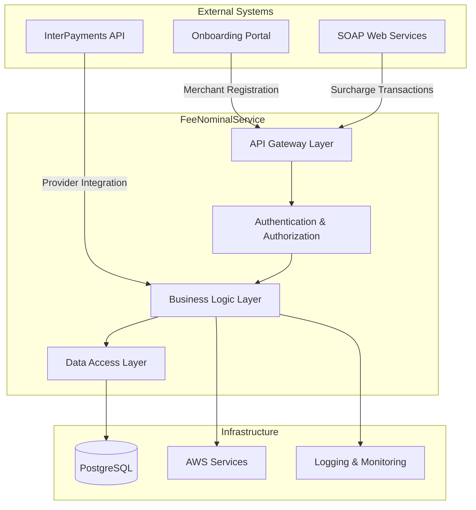
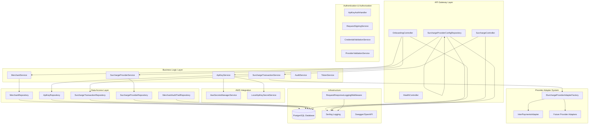
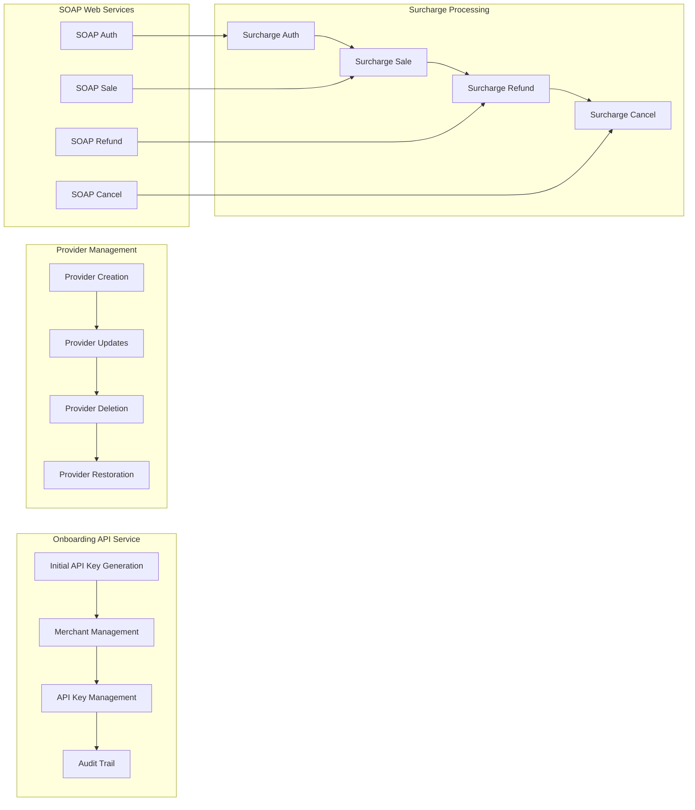
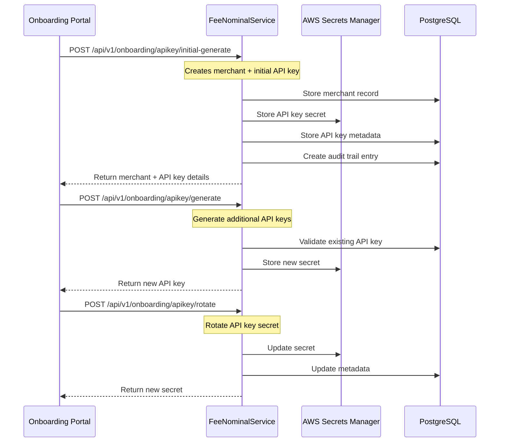
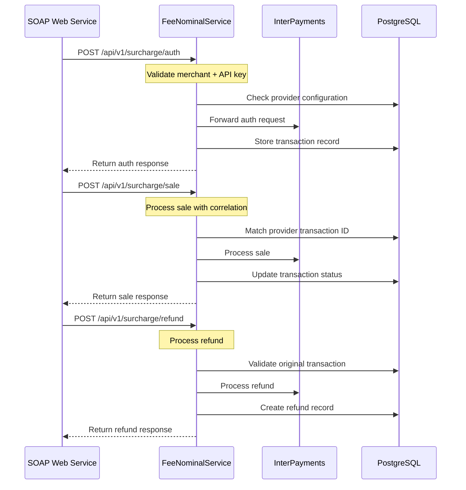
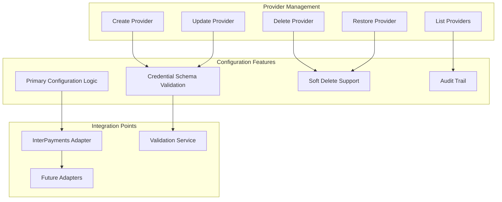
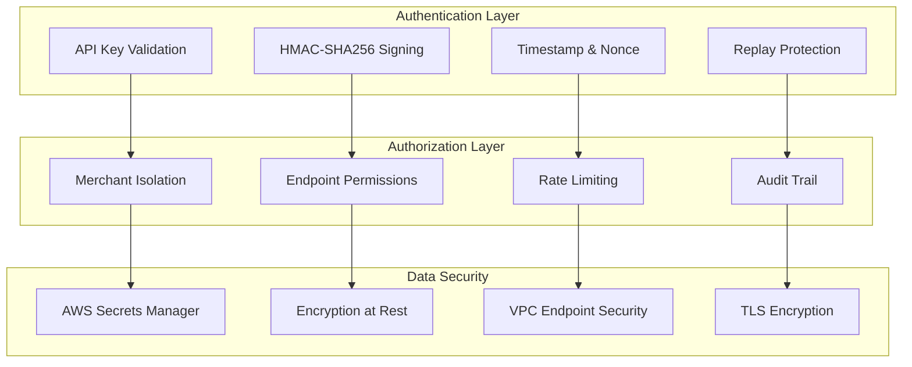
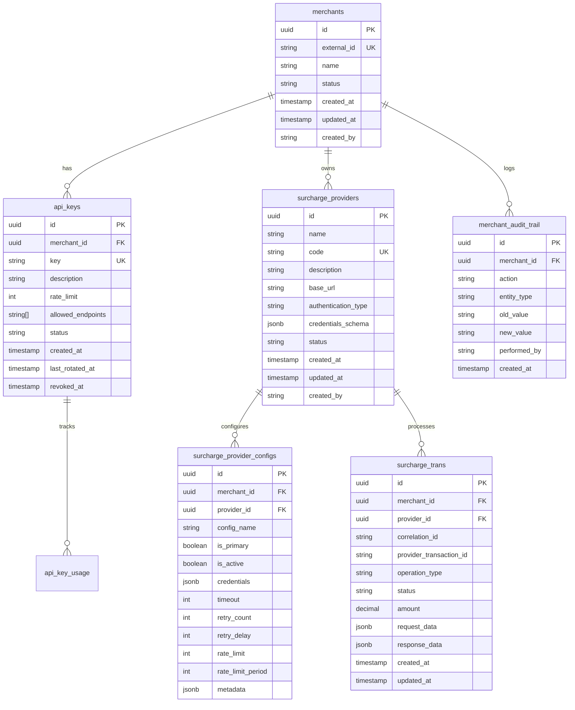

# FeeNominalService - Comprehensive Overview
## Enterprise Payment Processing Microservice Architecture

---

## Slide 1: Executive Summary
### **FeeNominalService Overview**
- **Purpose**: Enterprise-grade payment processing microservice for surcharge calculations, merchant management, and provider integrations
- **Technology Stack**: .NET 8.0, PostgreSQL, AWS Services, Entity Framework Core, Serilog, Swagger/OpenAPI
- **Architecture**: Clean Architecture with Repository Pattern, Dependency Injection
- **Security**: API Key Authentication, HMAC Request Signing, AWS Secrets Manager
- **Integration**: InterPayments API, Extensible Provider Adapter System, SOAP Web Services

---

## Slide 2: System Architecture Overview
### **Multi-Tier Architecture with External Integrations**

---

## Slide 3: Technical Architecture - Internal System Components
### **Detailed Internal Component Architecture**

---

## Slide 3: Core Business Capabilities
### **Primary Functions**

#### **1. Merchant Onboarding & Management**
- **Initial API Key Generation**: One-time setup with merchant registration
- **Merchant Lifecycle Management**: Create, update, status management
- **Audit Trail & Compliance**: Complete audit logging for all operations
- **External System Integration**: Support for onboarding portal integration

#### **2. Surcharge Processing**
- **Real-time Transaction Processing**: Auth, sale, refund, cancel operations
- **Multi-provider Support**: InterPayments primary, extensible adapter system
- **SOAP Web Service Integration**: Legacy system support
- **Transaction Correlation**: Provider transaction ID tracking

#### **3. Provider Management**
- **Dynamic Configuration**: Runtime provider configuration updates
- **Credential Schema Validation**: Type-safe credential management
- **Primary Configuration Logic**: Single primary config per merchant/provider
- **Soft Delete Support**: Audit-friendly deletion with restore capability

---

## Slide 4: API Endpoints & Integration Points
### **Comprehensive RESTful API Structure**

---

## Slide 5: Onboarding API Service Integration
### **Merchant Onboarding Workflow**

**Cool Capabilities:**
- ✅ **One-time Initial Setup**: Complete merchant + API key creation in single call
- ✅ **AWS Secrets Manager Integration**: Secure secret storage
- ✅ **Audit Trail**: Complete logging of all operations
- ✅ **API Key Rotation**: Secure key rotation with audit trail
- ✅ **External System Support**: Onboarding portal integration

---

## Slide 6: SOAP Web Service Integration
### **Legacy System Integration**

**Cool Capabilities:**
- ✅ **Legacy System Support**: SOAP web service integration
- ✅ **Transaction Correlation**: Provider transaction ID tracking
- ✅ **Follow-up Operations**: Auth → Sale → Refund/Cancel workflow
- ✅ **Merchant Isolation**: Strict data segregation
- ✅ **Provider Configuration Matching**: Dynamic provider selection

---

## Slide 7: Surcharge Provider Management
### **Dynamic Provider Configuration System**

**Cool Capabilities:**
- ✅ **Credential Schema Validation**: Type-safe credential management
- ✅ **Primary Configuration Logic**: Single primary per merchant/provider
- ✅ **Soft Delete with Restore**: Audit-friendly deletion
- ✅ **Include Deleted Option**: `?includeDeleted=true` for audit
- ✅ **Extensible Adapter System**: Easy addition of new providers

---

## Slide 8: Security Implementation
### **Multi-Layer Security Architecture**

**Cool Capabilities:**
- ✅ **HMAC Request Signing**: `(timestamp|nonce|merchantId|apiKey)` signature
- ✅ **Merchant Isolation**: Strict data segregation
- ✅ **AWS Secrets Manager**: Secure credential storage
- ✅ **Rate Limiting**: Per API key usage tracking
- ✅ **Audit Trail**: Complete operation logging

---

## Slide 9: Database Design & Data Flow
### **PostgreSQL Schema with Audit Trail**

---

## Slide 10: API Endpoints Summary
### **Comprehensive Endpoint Coverage**

#### **Onboarding Endpoints** (`/api/v1/onboarding`)
- `POST /apikey/initial-generate` - **One-time merchant + API key creation**
- `POST /apikey/generate` - **Additional API key generation**
- `POST /apikey/rotate` - **Secure API key rotation**
- `POST /apikey/revoke` - **API key revocation**
- `GET /apikey/list` - **List merchant API keys**
- `POST /merchants` - **Merchant creation**
- `GET /merchants/{id}` - **Get merchant details**
- `PUT /merchants/{id}` - **Update merchant**
- `GET /merchants/external/{externalId}` - **Get by external ID**
- `GET /merchants/{merchantId}/audit-trail` - **Audit trail retrieval**

#### **Surcharge Processing** (`/api/v1/surcharge`)
- `POST /auth` - **Initial authorization**
- `POST /sale` - **Sale processing**
- `POST /refund` - **Refund processing**
- `POST /cancel` - **Cancellation processing**
- `GET /transactions/{id}` - **Get transaction details**
- `GET /transactions` - **List transactions with pagination**

#### **Provider Management** (`/api/v1/merchants/{merchantId}/surcharge-providers`)
- `POST /` - **Create provider with configuration**
- `GET /` - **List providers (with `?includeDeleted=true` option)**
- `GET /{id}` - **Get provider details**
- `PUT /{id}` - **Update provider**
- `DELETE /{id}` - **Soft delete provider**
- `POST /{id}/restore` - **Restore deleted provider**

---

## Slide 11: Key Technical Achievements
### **Enterprise-Grade Features**

#### **🔐 Security & Compliance**
- **Multi-layer Authentication**: API key + HMAC signing + timestamp/nonce
- **Merchant Isolation**: Strict data segregation between tenants
- **AWS Secrets Manager**: Secure credential storage
- **Complete Audit Trail**: All operations logged for compliance

#### **🔄 Integration Capabilities**
- **Onboarding Portal Integration**: Complete merchant lifecycle management
- **SOAP Web Service Support**: Legacy system integration
- **Provider Adapter System**: Extensible provider integration
- **Transaction Correlation**: Provider transaction ID tracking

#### **⚡ Performance & Scalability**
- **Stateless Design**: Horizontal scaling support
- **Connection Pooling**: Database performance optimization
- **Rate Limiting**: Per API key usage tracking
- **Caching Strategies**: Response optimization

#### **🛠️ Developer Experience**
- **Comprehensive Documentation**: Swagger/OpenAPI integration
- **Error Handling**: Structured error responses
- **Validation**: Request/response validation
- **Monitoring**: Health checks and metrics

---

## **Summary: Key Achievements**
✅ **Enterprise Security**: Multi-layer authentication and encryption  
✅ **Scalable Architecture**: Clean separation of concerns and dependency injection  
✅ **Provider Flexibility**: Extensible adapter system for multiple payment providers  
✅ **Comprehensive Auditing**: Full audit trail and compliance tracking  
✅ **Legacy Integration**: SOAP web service support  
✅ **Onboarding Support**: Complete merchant lifecycle management  
✅ **Production Ready**: Monitoring, logging, and deployment automation  
✅ **API-First Design**: RESTful endpoints with comprehensive documentation  

**Technology Stack**: .NET 8.0, PostgreSQL, AWS Services, Entity Framework Core, Serilog, Swagger/OpenAPI 